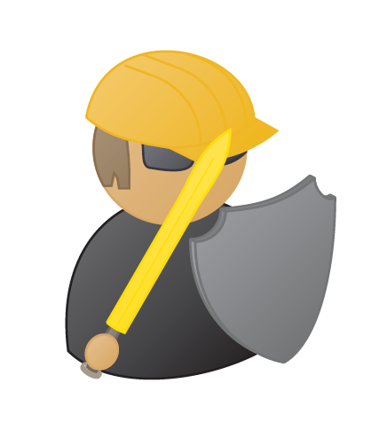

# Free Hong Kong TikZ package

The freehk package provides people shaped nodes to be used in tikz. It is to remember freedom fighter who are devoted to the movement in 2019.

It is based on tikzpeople package. 

The available node shapes are:

- protestor 
- hkpolice

The nodes have the following hopefully self explanatory options:
mask, umbrella, sign, evil, good, female, mirrored, monitor, shield, sword

All options can be combined freely.

The freehk package is licensed under the LATEX Project Public License.

– 2047freehk  Dec 2019

Fight for Freedom. Stand with Hong Kong.

## Installation

To install the package, just download the _freehke.sty_ file and all the shape files, i.e. _freehk.shape.shapename.sty_, somewhere _LaTeX_ can find them.
	
Option 1: Put them in your local _texmf_tree at _\textasciitilde/texmf/tex/latex/freehk/_.
	
Option 2:	Put them into the folder where your main _.tex_ file resides.
